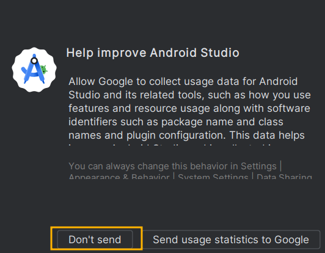

# Learning-Android-Programming

这是一个记录学习安卓开发的仓库。

将大二写的课程作业重新整理了出来，打赢复活赛了。

### 环境配置

Ubuntu 22.04 + 最新版 Android Studio（2024.3.29）

**（1）安装 JDK**

```
sudo apt install openjdk-11-jdk
```

```
$ java -version
openjdk 11.0.22 2024-01-16
OpenJDK Runtime Environment (build 11.0.22+7-post-Ubuntu-0ubuntu222.04.1)
OpenJDK 64-Bit Server VM (build 11.0.22+7-post-Ubuntu-0ubuntu222.04.1, mixed mode, sharing)
```

**（2）安装 Android SDK**

还是用Android Studio 进行开发把

```
https://developer.android.com/studio#downloads
```

下载压缩包：

```
android-studio-2023.2.1.24-linux.tar.gz
```

解压之后得到：


```
cd bin
sh ./studio.sh
```

所有设置存储在这个目录下

```
~/.config/Google/AndroidStudio4.1
```

数据缓存在：

```
~/.local/share/Google/AndroidStudio4.1
```





起始界面：


SDK默认安装位置：

```
~/Android/Sdk
```


**（3）添加快捷方式**

假设android-studio的路径在下面这个地方：

```
~/Documents/android-studio
```

```
sudo ln -s ~/Documents/android-studio/bin/studio.sh /usr/bin/android-studio
```

可以在终端中输入 `android-studio` 即可启动Android-Studio

```
sudo vim /usr/share/applications/android-studio.desktop
```

```
[Desktop Entry]
Type=Application
Name=Android Studio
Comment=Android Studio Integrated Development Environment
Icon=~/Documents/android-studio/bin/studio.png
Exec=~/Documents/android-studio/bin/studio.sh
Terminal=false
```


**（4）SDK Manager**


**（5）Android Studio的一些设置**

字体、主题


**（6）手动安装 gradle**

```
Could not install Gradle distribution from 'https://services.gradle.org/distributions/gradle-7.0.2-bin.zip'.
Reason: java.net.SocketTimeoutException: Read timed out
```

File——>Settings——>Gradle——> Build,Execution,Deployment —>Build Tools——>Gradle 


将 下载得到的gradle安装包放入 `.gradle/wrapper/dists`

不需要解压！

每个项目的gradle配置信息在这里：

```
./gradle/wrapper/gradle-wrapper.properties
```

一个可能的内容如下：

```
distributionBase=GRADLE_USER_HOME
distributionPath=wrapper/dists
distributionUrl=https\://services.gradle.org/distributions/gradle-7.2-bin.zip
zipStoreBase=GRADLE_USER_HOME
zipStorePath=wrapper/dists
```


最好的办法就是设置代理服务器。

File->Settings->Apperance & Behavior->System Settings->**HTTP Proxy**


至于梯子用什么，推荐PigCha Proxy。

**设置后，能显著提神速度。**


### 代码解释

**Calculator**

一个计算器


**Counter**

一个计时器


**Login**

简易的登陆界面


**Music_player**

一个音乐播放器


